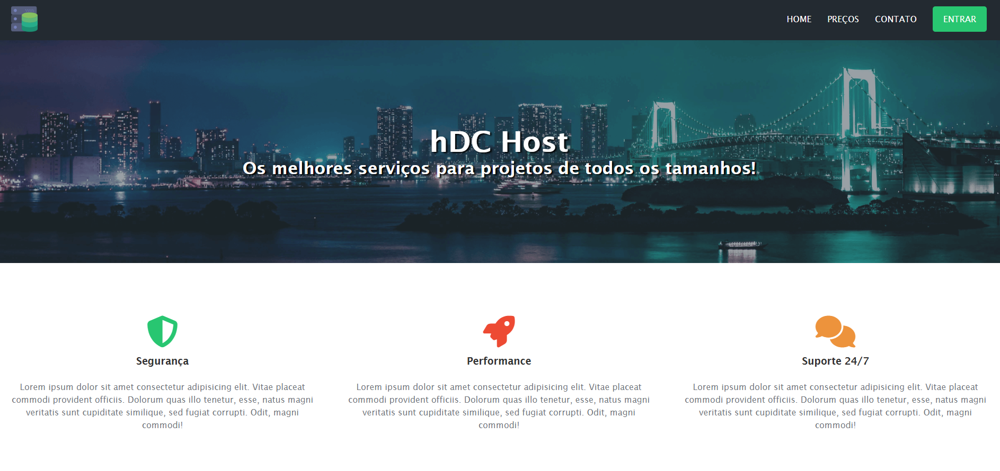

# 🌐 HDC Host - Landing Page de Hospedagem de Sites

[](https://developer.mozilla.org/pt-BR/docs/Web/HTML)
[](https://developer.mozilla.org/pt-BR/docs/Web/CSS)
[]()
[]()
[](https://opensource.org/licenses/MIT)

---

 
Você pode ver o projeto em funcionamento [aqui](https://hdc-host-lovat.vercel.app/).
---

## 📋 Descrição

Este é um projeto de página web responsiva para uma empresa fictícia de hospedagem de sites, chamada **HDC Host**. O site apresenta os planos de hospedagem, formulário de contato e uma interface visual moderna.

---

## 🧰 Tecnologias Utilizadas

- **HTML5**
- **CSS3**
- **Font Awesome** (ícones)
- **Media Queries** para responsividade

---

## 💡 Funcionalidades

- Navegação com barra de menu fixa
- Banner com chamada de ação
- Sessão de serviços com ícones
- Planos com destaque visual
- Simulador de busca de domínios (formulário ilustrativo)
- Formulário de contato funcional (sem back-end)
- 100% responsivo

## 📱 Responsividade

✅ O layout se adapta a diferentes tamanhos de tela (desktop, tablet, celular), utilizando breakpoints e Flexbox.

---

## 🚀 Como Visualizar

Clone o repositório e abra o arquivo `index.html` em seu navegador:

```bash
git clone https://github.com/seu-usuario/seu-repositorio.git
cd seu-repositorio
